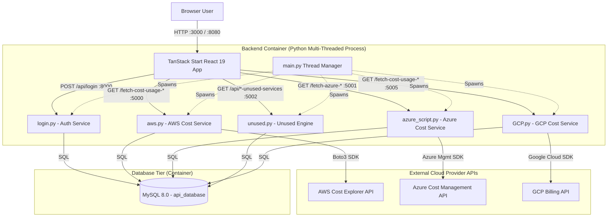
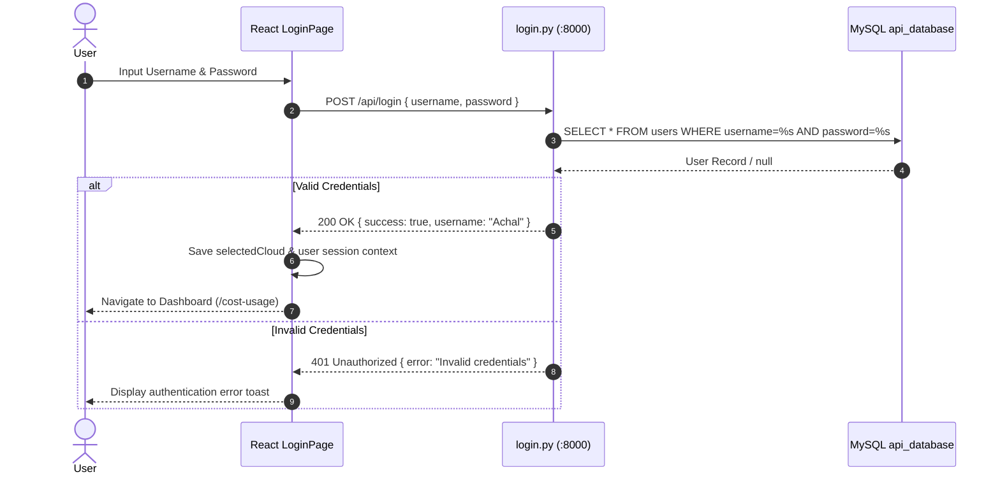
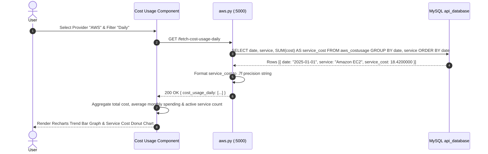
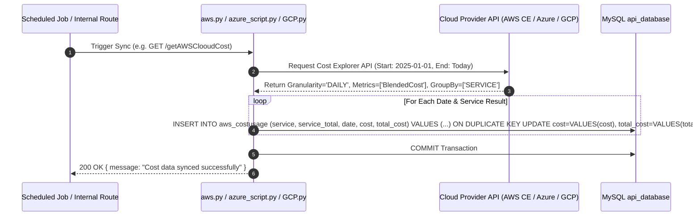
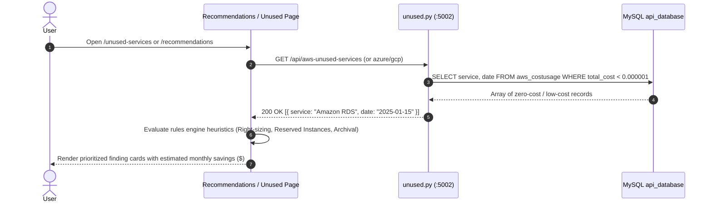

# ARCHITECTURE.md - Cloud Advisor System Architecture & Design

This document details the architectural design, container topology, request lifecycles, data flows, and algorithmic rules engine powering the **Cloud Advisor** multi-cloud cost intelligence platform.

---

## High-Level System Architecture

Cloud Advisor uses a **three-tier microservices-inspired architecture** comprising:

1. **Presentation Layer**: A modern Single Page Application (SPA) built with **React 19**, **TanStack Start**, **Vite**, **TypeScript**, and **Tailwind CSS v4**.
2. **API & Business Logic Layer**: A **Python 3.10 Flask** backend container utilizing a multi-threaded process orchestrator (`main.py`) that executes 5 specialized microservice listeners on dedicated ports (`8000`, `5000`, `5001`, `5002`, `5005`).
3. **Data Persistence Layer**: A containerized **MySQL 8.0** relational database (`api_database`) storing historical cost usage records, user accounts, and benchmark instance utilization data.



---

## Container & Network Topology

The application stack is orchestrated via `docker-compose.yml` on an isolated bridge network named `app-network`.

```text
+---------------------------------------------------------------------------------------+
|                                    DOCKER HOST                                        |
|                                                                                       |
|  +----------------------+     +-------------------------------+     +--------------+  |
|  |       frontend       |     |            backend            |     |    mysql     |  |
|  | (React / TanStack)   |     | (Python Flask Multi-Thread)   |     | (MySQL 8.0)  |  |
|  |                      |     |                               |     |              |  |
|  | Port: 3000 / 8080    |     | Port 8000: Login              |     | Port: 3306   |  |
|  |                      |     | Port 5000: AWS API            |     |    -> 3308   |  |
|  |                      |     | Port 5001: Azure API          |     |              |  |
|  |                      |     | Port 5002: Unused API         |     |              |  |
|  |                      |     | Port 5005: GCP API            |     |              |  |
|  +----------+-----------+     +---------------+---------------+     +------+-------+  |
|             |                                 |                            |          |
|             +---------------------------------+----------------------------+          |
|                                         app-network                                   |
+---------------------------------------------------------------------------------------+
```

---

## Detailed Sequence & Data Flows

### 1. Authentication Lifecycle



---

### 2. Cost Dashboard Query Flow (AWS Example)



---

### 3. Cloud Provider Live Synchronization Flow



---

### 4. Unused Service & Recommendations Flow



---

## Algorithmic Rules & Recommendation Heuristics

The **Recommendation Engine** evaluates resource utilization metrics stored in MySQL (`book1`, `costusage`, `aws_costusage`, `azureusage`, `gcp_costusage`) against specific heuristic rules:

### 1. Unused / Idle Service Detection Rules
- **AWS Threshold**: `total_cost < 0.000001` over a 30-day window -> Tagged as *Zero-Cost / Idle Service*.
- **Azure Threshold**: `PreTaxCost <= 3.00` over billing cycle -> Tagged as *Minimal Utilization Service*.
- **GCP Threshold**: `cost <= 10.00` over billing cycle -> Tagged as *Low Activity Resource*.

### 2. Compute Right-Sizing Heuristic
$$\text{Average CPU} < 15\% \quad \text{AND} \quad \text{Average Memory} < 25\% \implies \text{Recommend Downsizing SKU}$$
- *Action*: Downsize instance tier by one step (e.g. `m5.2xlarge` $\to$ `m5.xlarge`), yielding an estimated **50% cost reduction**.

### 3. Reserved Instances (RI) / Savings Plans Heuristic
$$\text{Service Run Hours} \ge 720 \text{ hrs/month} \quad \text{AND} \quad \text{Utilization Consistency} \ge 90\% \implies \text{Recommend 1-Yr / 3-Yr RI}$$
- *Action*: Purchase 1-Year or 3-Year Reserved Instances / Savings Plans, yielding an estimated **30%--60% cost reduction**.

### 4. Object Storage Archival Heuristic
$$\text{Last Read Access} \ge 30 \text{ days} \quad \text{AND} \quad \text{Bucket Storage} > 100 \text{ GB} \implies \text{Recommend Storage Tier Transition}$$
- *Action*: Transition objects from S3 Standard / Blob Standard to Glacier / Coldline storage, yielding an estimated **70% storage cost reduction**.
